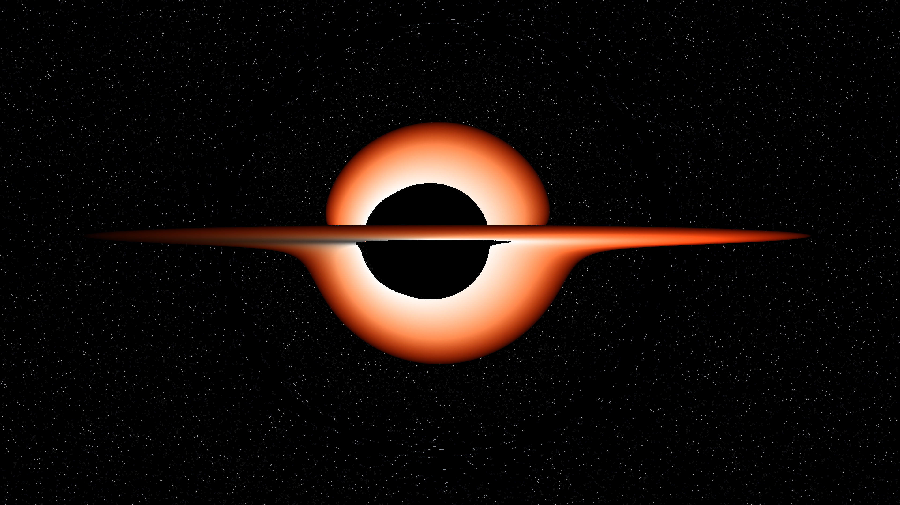
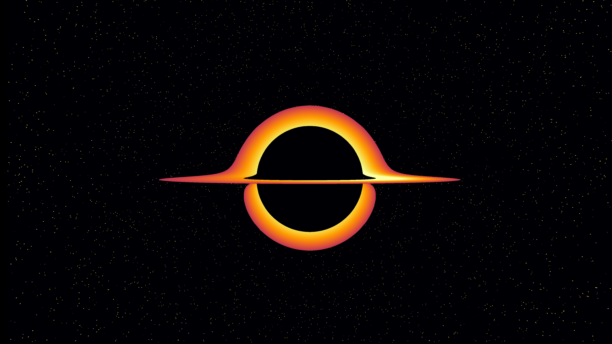
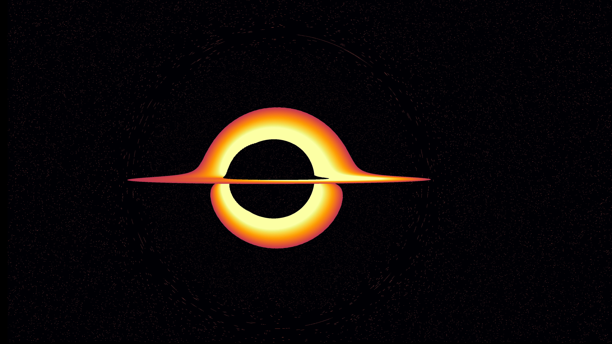
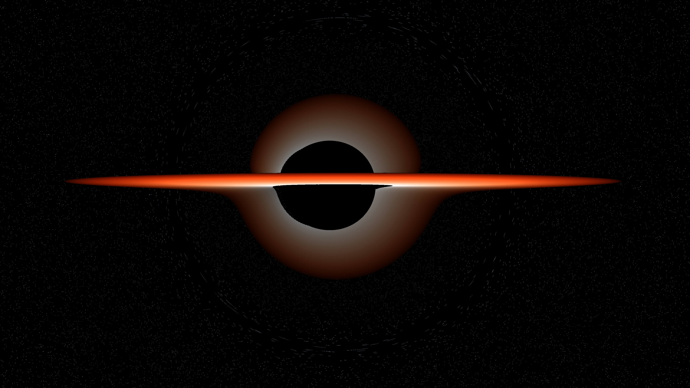

# BlackHole.jl 🕳️

> GPU-accelerated Kerr black hole raytracer written in Julia.  
> Renders a physically accurate spinning black hole with relativistic  
> accretion disk in seconds on consumer hardware.



---

## ✨ Features

- **Kerr metric geodesic raytracing** — full spinning black hole physics
- **Frame dragging** — spacetime rotation via spin parameter `a` (0→1)
- **Relativistic Doppler boosting** — asymmetric disk brightness from spin
- **RGB blackbody accretion disk** — white-hot inner edge → deep crimson outer
- **4K GPU rendering** — ~10 seconds on RTX 4070 via CUDA.jl
- **Live orbital viewer** — drag to orbit the black hole in real time (GLMakie)
- **Coloured starfield** — blue/white/red stars by temperature class

---

## 🚀 Quick Start

### Requirements
- Julia 1.10+
- NVIDIA GPU with CUDA support

### Install

```bash
git clone https://github.com/VedantMahadik-qc/BlackHole_Julia
cd BlackHole_Julia
julia --project=. -e 'using Pkg; Pkg.instantiate()'
```

### Static 4K Render

```bash
julia --project=. BlackHoleJulia/examples/kerr_render.jl
```

### Wallpaper Render (3840×2160)

```bash
julia --project=. BlackHoleJulia/examples/wallpaper.jl
```

### Live Interactive Viewer

```bash
julia --project=. BlackHoleJulia/examples/kerr_interactive.jl
# Drag mouse to orbit around the black hole in real time
```

---

## 🎛️ Parameters

| Parameter | Description | Default |
|---|---|---|
| `a` | Spin (0 = Schwarzschild, 0.99 = near-max Kerr) | `0.9` |
| `M` | Black hole mass (geometric units) | `1.0` |
| `cam_z` | Camera elevation above disk plane | `0.5` |
| `disk_outer` | Accretion disk outer radius | `12.0` |
| `W, H` | Output resolution | `3840×2160` |

---

## 📸 Gallery

| Gargantua style | M87* style | RGB Kerr |
|---|---|---|
|  |  |  |
---

## 🔭 Physics

Geodesics are integrated in Boyer-Lindquist coordinates using the Kerr metric.
Frame dragging couples photon velocity components via angular momentum
`ω = 2Mar / (ρ⁴ + a²r²)`. The accretion disk uses a blackbody temperature
gradient — inner orbits render white-hot, outer orbits cool to deep crimson.

---

## 🛠️ Built With

- [Julia](https://julialang.org/)
- [CUDA.jl](https://github.com/JuliaGPU/CUDA.jl)
- [KernelAbstractions.jl](https://github.com/JuliaGPU/KernelAbstractions.jl)
- [GLMakie.jl](https://github.com/MakieOrg/Makie.jl)
- [Images.jl](https://github.com/JuliaImages/Images.jl)